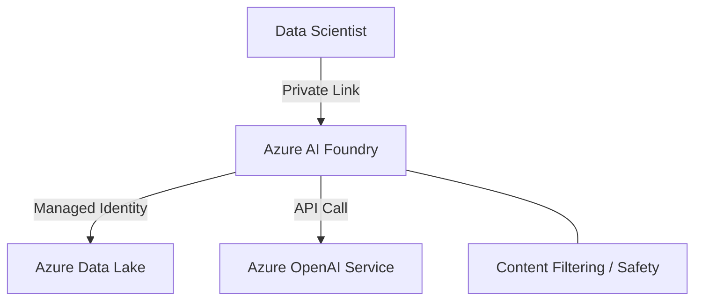

# AI (Azure AI Foundry)
> **Architecture :** Plateforme unifiée pour le développement, le déploiement et la gestion des modèles d'IA (incluant Azure OpenAI), offrant un environnement sécurisé pour les cycles de vie ML/IA. | **Version :** v2.3 | **Maintainer :** [Ravindra JOB](https://github.com/ravindrajob/)
---

## Hardening & Gouvernance
- **Sécurisation des Workspaces** : Déploiement des espaces de travail Azure AI avec isolation réseau complète (No Public IP).
- **Content Filtering** : Activation des filtres de contenu Azure OpenAI pour détecter et bloquer les contenus inappropriés ou dangereux à la source.
- **RBAC Granulaire** : Utilisation de rôles Azure RBAC personnalisés pour séparer les fonctions de Data Scientist, ML Engineer et Auditor.
- **Identity Passthrough** : Utilisation de Managed Identities pour l'accès sécurisé aux données dans Azure Data Lake Storage Gen2.
- **Standards** : Alignement avec les principes de "Responsible AI" de Microsoft et le framework de sécurité CNCF.

## Schéma Mermaid

## Conclusion
Adoption industrialisée du CAF avec surcouche de sécurité et intégration des pratiques CNCF.
