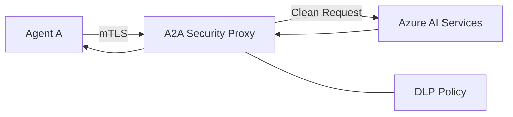

# Ravindra JOB - Cloud Architect
## Composant Landing Zone - AISecurity (A2A Proxy)
### Version: v1.2

## Rôle du composant
Proxy de sécurité spécialisé pour l'intermédiation des communications Agent-to-Agent (A2A) et la protection des flux d'inférence d'IA au sein de l'écosystème Azure.

## Hardening & Gouvernance
- **Inspection de Payload** : Analyse en temps réel des flux pour détecter les injections de prompts malveillants et l'exfiltration de données sensibles.
- **mTLS Forcé** : Obligation de certificats mutuels pour toute communication entre les agents et le proxy, garantissant l'identité des appelants.
- **Quotas & Throttling** : Gestion fine de la consommation des APIs d'IA par agent pour éviter la saturation des ressources et maîtriser les coûts.
- **Logging de Sécurité** : Centralisation des journaux d'appels dans Azure Sentinel pour une détection proactive des comportements anormaux.
- **Standards** : Intégration des principes "Zero Trust" et conformité avec les recommandations de sécurité IA de la CNCF.

## Schéma Mermaid

## Conclusion
Adoption industrialisée du CAF avec surcouche de sécurité et intégration des pratiques CNCF.
