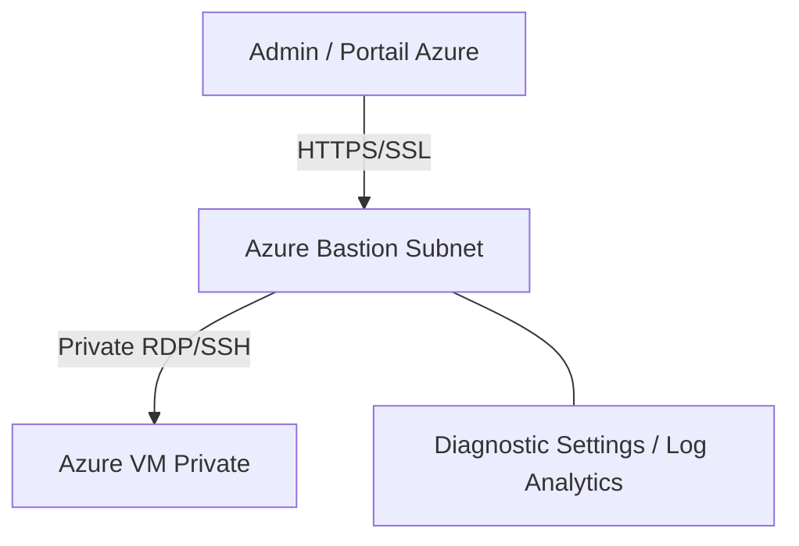

# Ravindra JOB - Cloud Architect
## Composant Landing Zone - Bastion (Azure Bastion PaaS)
### Version: v1.2

## Rôle du composant
Fourniture d'un accès RDP/SSH sécurisé et sans agent aux machines virtuelles Azure directement via le portail Azure sur SSL, sans exposition d'IP publiques.

## Hardening & Gouvernance
- **Accès sans IP Publique** : Élimination du besoin d'assigner des adresses IP publiques aux VMs pour l'administration.
- **Azure Bastion SKU Premium** : Utilisation du SKU Premium pour supporter des fonctionnalités avancées comme le tunneling IP et le partage de liens.
- **Contrôle d'Accès IAM** : Restriction de l'utilisation du Bastion via des rôles IAM spécifiques sur la ressource Bastion et la VM cible.
- **Audit de Session** : Journalisation de toutes les tentatives de connexion et diagnostics de session stockés dans Azure Log Analytics.
- **Standards** : Conformité avec les principes de sécurité périmétrique du CAF et les stratégies de réduction de la surface d'attaque.

## Schéma Mermaid

## Conclusion
Adoption industrialisée du CAF avec surcouche de sécurité et intégration des pratiques CNCF.
