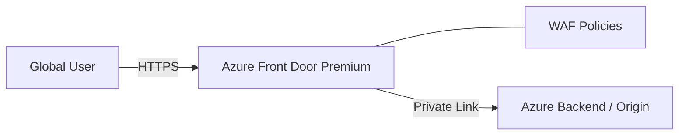

# Ravindra JOB - Cloud Architect
## Composant Landing Zone - CDN (Front Door Premium)
### Version: v1.2

## Rôle du composant
Réseau de diffusion de contenu (CDN) moderne et sécurisé, offrant une accélération globale des applications et une protection WAF au niveau de l'Edge.

## Hardening & Gouvernance
- **WAF à l'Edge** : Protection contre les attaques L7 (OWASP Top 10) au plus près de l'utilisateur, avant que le trafic n'atteigne le réseau Azure.
- **Private Link Origin** : Sécurisation de la communication entre Front Door et les origines Azure (App Service, Storage) via Azure Private Link.
- **SSL Offloading & Hardening** : Gestion centralisée des certificats TLS et imposition de versions minimales sécurisées (TLS 1.2+).
- **Protection DDoS** : Intégration native avec Azure DDoS Protection pour contrer les attaques volumétriques.
- **Standards** : Conformité avec les services Edge du CAF et les standards de sécurité de diffusion CNCF.

## Schéma Mermaid

## Conclusion
Adoption industrialisée du CAF avec surcouche de sécurité et intégration des pratiques CNCF.
