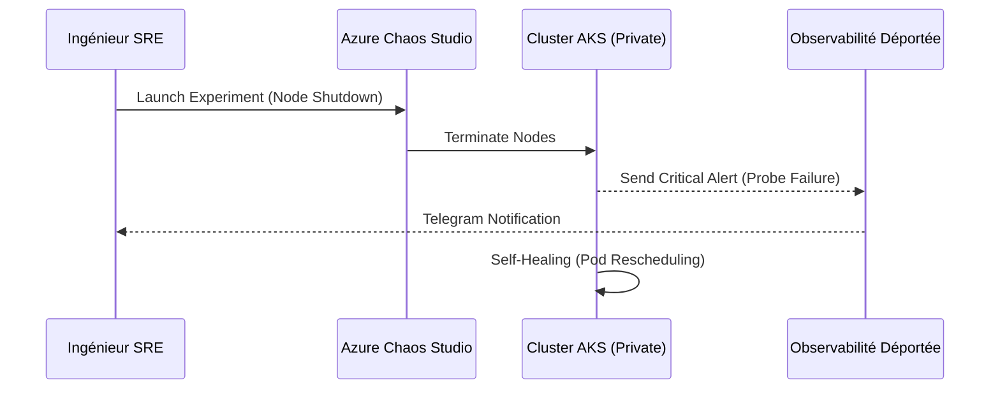

# ChaosEngineering (Azure Chaos Studio)
> **Architecture :** Service managé d'injection de pannes pour tester la haute disponibilité | **Version :** v2.3 | **Maintainer :** [Ravindra JOB](https://github.com/ravindrajob/)
---

## Rôle du composant
Utilisation du service natif **Azure Chaos Studio** pour orchestrer des scénarios de panne (shutdown de nœuds AKS, latence réseau, saturation CPU) et valider la résilience du Datacenter Azure.

## Hardening & Gouvernance
- **Validation DRP (Microsoft CAF) :** Vérifie que les briques PaaS (SQL, Storage) et l'orchestrateur AKS supportent la perte d'une zone.
- **Observabilité de Panne :** Teste la réactivité des alertes Azure Monitor et l'export vers le NOC central.
- **Zéro Trust Resilience :** S'assure que les politiques de sécurité (WIF, Private Link) restent opérationnelles même en mode dégradé.

## Schéma Mermaid

## Conclusion
Adoption industrialisée du CAF avec surcouche de sécurité et intégration des pratiques CNCF.
