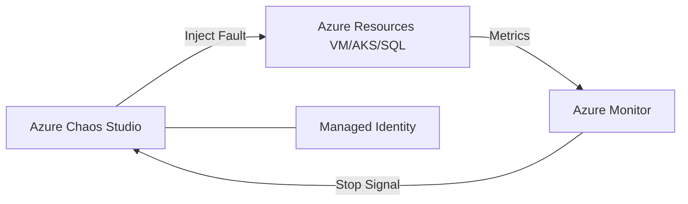

# Ravindra JOB - Cloud Architect
## Composant Landing Zone - ChaosEngineering (Chaos Studio)
### Version: v1.2

## Rôle du composant
Solution managée pour l'expérimentation de fautes sur Azure (Chaos Studio), permettant de mesurer et d'améliorer la résilience des applications et de l'infrastructure.

## Hardening & Gouvernance
- **Expériences par Permissions** : Utilisation d'identités managées avec le principe du moindre privilège pour l'exécution des injections de fautes.
- **Coupe-circuit de Sécurité** : Mise en œuvre de conditions d'arrêt basées sur Azure Monitor pour stopper les expériences si des indicateurs de santé critiques sont dégradés.
- **Isolation d'Environnement** : Restriction stricte des cibles d'expérimentation via des tags Azure pour éviter tout impact sur la production.
- **Audit Post-Chaos** : Génération de rapports de résilience automatisés pour alimenter le cycle d'amélioration continue.
- **Standards** : Intégration des pratiques de Chaos Engineering préconisées par la CNCF et le pilier "Reliability" du CAF.

## Schéma Mermaid

## Conclusion
Adoption industrialisée du CAF avec surcouche de sécurité et intégration des pratiques CNCF.
