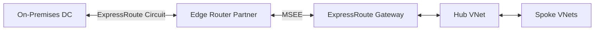

# Ravindra JOB - Cloud Architect
## Composant Landing Zone - Connectivity (ExpressRoute)
### Version: v1.2

## Rôle du composant
Établissement d'une connexion privée, résiliente et à haut débit entre l'infrastructure on-premises et Azure via un circuit ExpressRoute, contournant l'Internet public.

## Hardening & Gouvernance
- **Chiffrement en Transit** : Option de déploiement d'IPsec over ExpressRoute pour garantir un chiffrement de bout en bout conforme aux normes de sécurité élevées.
- **Diversité de Circuit** : Configuration de circuits secondaires et de passerelles hautement disponibles pour assurer une résilience maximale (SLA 99.95%+).
- **Filtrage de Routes** : Utilisation de filtres BGP et de limites de préfixes pour empêcher l'injection de routes non autorisées dans le réseau Azure.
- **Supervision Network Insights** : Monitoring continu de la bande passante, des erreurs de circuit et de la latence via Azure Monitor Network Insights.
- **Standards** : Conformité avec les architectures "Hybrid Networking" de l'Azure CAF.

## Schéma Mermaid

## Conclusion
Adoption industrialisée du CAF avec surcouche de sécurité et intégration des pratiques CNCF.
