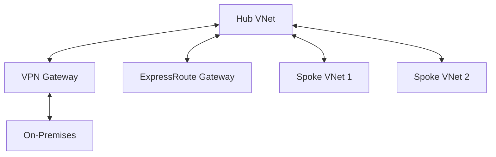

# Connectivity
> **Architecture :** Module transverse gérant l'interconnexion globale des réseaux, incluant le Hub VNet, les passerelles VPN et le routage centralisé. | **Version :** v2.3 | **Maintainer :** [Ravindra JOB](https://github.com/ravindrajob/)
---

## Hardening & Gouvernance
- **Hub-and-Spoke Topology** : Mise en œuvre d'une architecture centralisée pour une gestion uniforme de la sécurité et du routage.
- **VPN Gateway S2S** : Configuration de tunnels VPN sécurisés avec chiffrement fort (AES-256) pour la connectivité hybride de secours.
- **Forced Tunneling** : Configuration du routage pour garantir que tout le trafic vers Internet passe par un point d'inspection central.
- **Network Watcher** : Activation des outils de diagnostic réseau pour le dépannage et la surveillance des flux.
- **Standards** : Respect des principes de connectivité du CAF et des modèles de réseau Cloud Native.

## Schéma Mermaid

## Conclusion
Adoption industrialisée du CAF avec surcouche de sécurité et intégration des pratiques CNCF.
