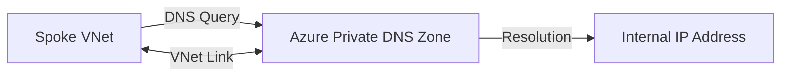

# Ravindra JOB - Cloud Architect
## Composant Landing Zone - DNS (Azure Private DNS)
### Version: v1.2

## Rôle du composant
Service de résolution de noms de domaine hautement disponible et sécurisé pour les ressources au sein des VNets Azure, sans exposition sur l'Internet public.

## Hardening & Gouvernance
- **Virtual Network Links** : Association explicite des zones DNS uniquement aux VNets autorisés, empêchant les fuites d'informations DNS.
- **Auto-registration** : Activation contrôlée de l'enregistrement automatique des noms d'hôtes pour simplifier la gestion des cycles de vie des VMs.
- **Centralisation Hub & Spoke** : Résolution centralisée via le VNet Hub avec des forwarders pour les architectures hybrides.
- **Audit des requêtes** : Activation des logs de diagnostic pour tracer toutes les résolutions DNS internes.
- **Standards** : Alignement avec les guides de conception réseau de l'Azure CAF.

## Schéma Mermaid

## Conclusion
Adoption industrialisée du CAF avec surcouche de sécurité et intégration des pratiques CNCF.
