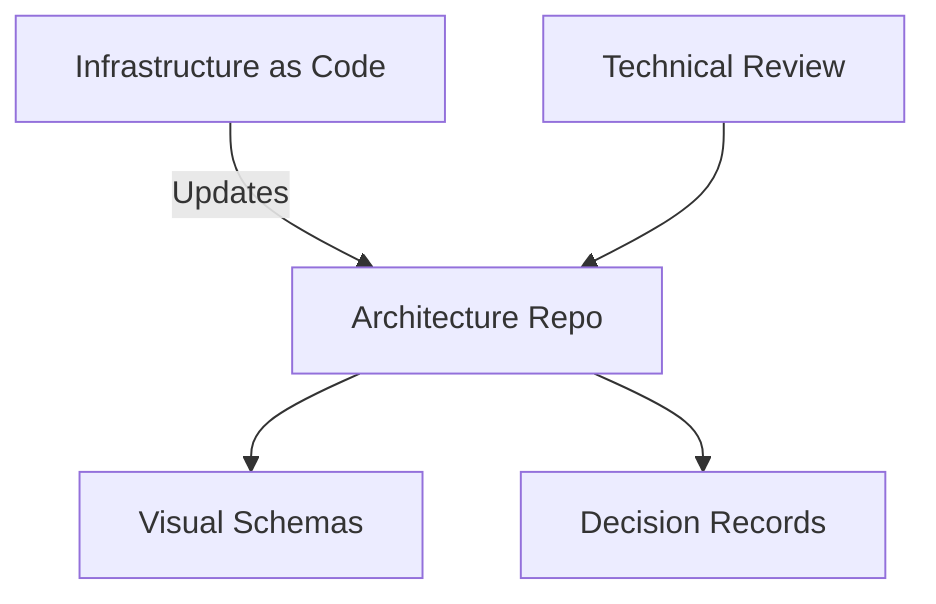

# Documentation (Architecture)
> **Architecture :** Référentiel centralisé pour la documentation technique, les schémas d'architecture et les registres de décisions (ADR) de la landing zone Azure. | **Version :** v2.3 | **Maintainer :** [Ravindra JOB](https://github.com/ravindrajob/)
---

## Hardening & Gouvernance
- **Docs as Code** : Utilisation du format Markdown pour une intégration fluide dans les pipelines de CI/CD et une traçabilité via Git.
- **Diagrammes Mermaid/PlantUML** : Standardisation des représentations visuelles pour garantir une maintenance aisée et une versionisation cohérente.
- **Workflow de Revue** : Validation obligatoire par les pairs (Pull Requests) pour toute modification de la documentation d'architecture.
- **Indexation par Service** : Organisation structurée facilitant la découverte des composants et de leurs spécificités de sécurité.
- **Standards** : Alignement avec les bonnes pratiques de documentation du CAF et les standards de communication technique CNCF.

## Schéma Mermaid

## Conclusion
Adoption industrialisée du CAF avec surcouche de sécurité et intégration des pratiques CNCF.
