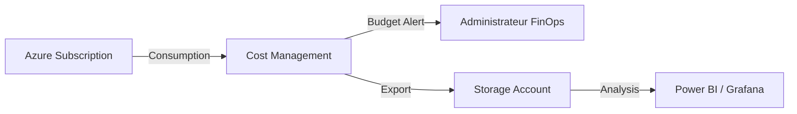

# FinOps (Cost Management & Budgets)
> **Architecture :** Gouvernance financière et optimisation des coûts Azure | **Version :** v2.3 | **Maintainer :** [Ravindra JOB](https://github.com/ravindrajob/)
---

## Rôle du composant
Ce module permet de piloter la consommation financière du datacenter Azure. Il définit les limites budgétaires au niveau de la souscription et automatise l'exportation des données pour une visibilité accrue des dépenses.

## Hardening & Gouvernance
- **Budgetary Guardrails (FinOps) :** Alertes automatiques déclenchées à 90% du budget prévu pour éviter le "Cloud Sprawl".
- **Cost Data Export (Gouvernance) :** Exportation vers un Storage Account chiffré pour archivage et audit.
- **CAF Alignment :** Respect du pilier "Cost Management" de l'Azure Cloud Adoption Framework.

## Schéma Mermaid

## Conclusion
Adoption industrialisée du CAF avec surcouche de sécurité et intégration des pratiques CNCF.
