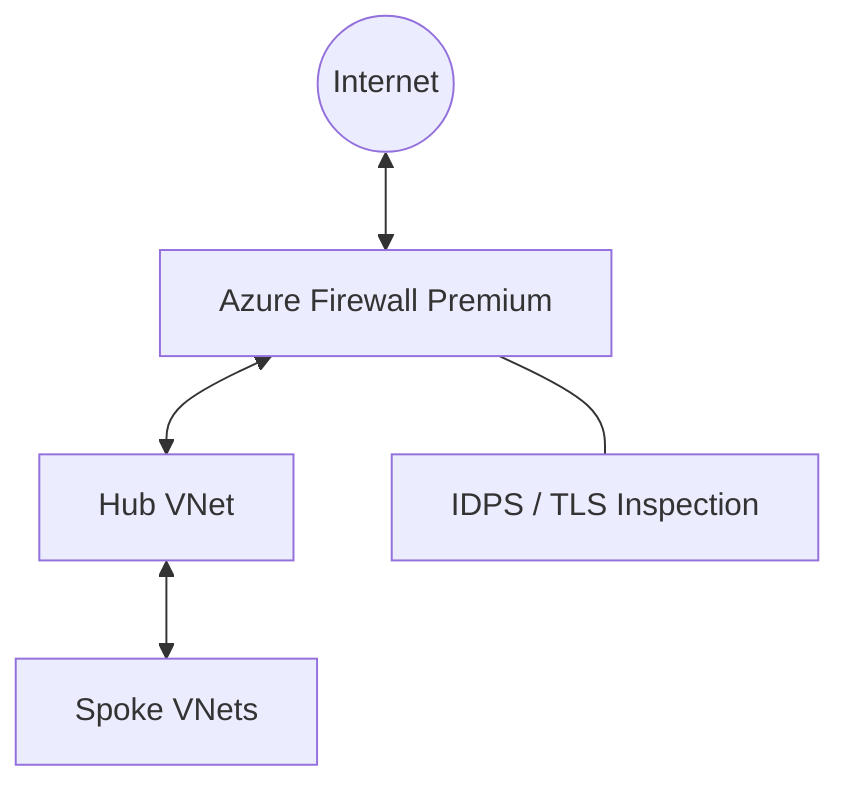

# Ravindra JOB - Cloud Architect
## Composant Landing Zone - Firewall (Azure Firewall Premium)
### Version: v1.2

## Rôle du composant
Pare-feu réseau managé de nouvelle génération (NGFW) offrant une protection de haut niveau pour les ressources du VNet Azure, avec inspection profonde du trafic.

## Hardening & Gouvernance
- **IDPS Premium** : Activation du système de détection et de prévention d'intrusions (IDPS) basé sur les signatures pour bloquer les menaces connues.
- **TLS Inspection** : Déchiffrement et inspection du trafic HTTPS pour détecter les menaces cachées dans les flux chiffrés.
- **Filtrage d'URLs** : Restriction de l'accès sortant basée sur des noms de domaine (FQDN) et des URLs spécifiques.
- **Renseignement sur les menaces** : Mise à jour continue des règles basée sur le Threat Intelligence de Microsoft.
- **Standards** : Alignement avec les préconisations de sécurité périmétrique du CAF et les standards de protection réseau CNCF.

## Schéma Mermaid

## Conclusion
Adoption industrialisée du CAF avec surcouche de sécurité et intégration des pratiques CNCF.
