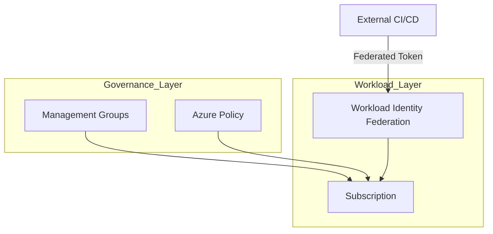

# Ravindra JOB - Cloud Architect
## Composant Landing Zone - Governance (Azure Policies & WIF)
### Version: v1.2

## Rôle du composant
Mécanisme central de gouvernance et de conformité automatisée via Azure Policy, couplé à la gestion d'identité moderne via Workload Identity Federation (WIF).

## Hardening & Gouvernance
- **Guardrails Azure Policy** : Déploiement d'initiatives de conformité (ex: ISO 27001, PCI-DSS) pour empêcher la création de ressources non conformes.
- **Workload Identity (WIF)** : Utilisation de la fédération d'identité pour permettre aux pipelines de CI/CD externes (GitHub, GitLab) d'accéder à Azure sans secrets statiques.
- **Management Groups** : Organisation hiérarchique des souscriptions pour une application cohérente des politiques à l'échelle de l'entreprise.
- **Remédiation Automatisée** : Mise en œuvre de tâches de remédiation pour corriger automatiquement les ressources existantes non conformes.
- **Standards** : Application stricte du pilier "Governance" de l'Azure CAF et des principes d'automatisation de la conformité CNCF.

## Schéma Mermaid

## Conclusion
Adoption industrialisée du CAF avec surcouche de sécurité et intégration des pratiques CNCF.
