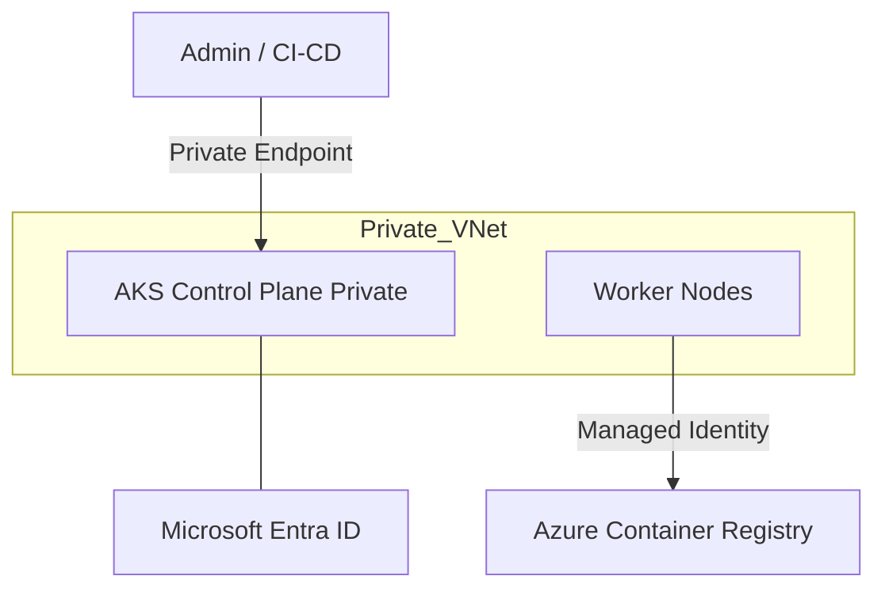

# Kubernetes (AKS Private)
> **Architecture :** Déploiement de clusters Azure Kubernetes Service (AKS) en mode entièrement privé, isolant le plan de contrôle et les worker nodes du réseau public. | **Version :** v2.3 | **Maintainer :** [Ravindra JOB](https://github.com/ravindrajob/)
---

## Hardening & Gouvernance
- **API Server Isolation** : Utilisation d'un endpoint privé pour l'accès à l'API Kubernetes, accessible uniquement via un réseau VPN/ExpressRoute autorisé.
- **Azure Policy for Kubernetes** : Application de politiques d'admission pour forcer les bonnes pratiques intra-cluster (ex: interdiction du mode root, restriction des images).
- **Intégration Microsoft Entra ID** : Authentification et autorisation (RBAC) basées nativement sur Microsoft Entra ID pour une gestion d'identité unifiée.
- **Network Policies** : Utilisation d'Azure CNI avec support d'Azure Network Policies pour isoler les flux entre les Pods.
- **Standards** : Respect du AKS Security Baseline, du CAF et des recommandations de sécurité CNCF.

## Schéma Mermaid

## Conclusion
Adoption industrialisée du CAF avec surcouche de sécurité et intégration des pratiques CNCF.
