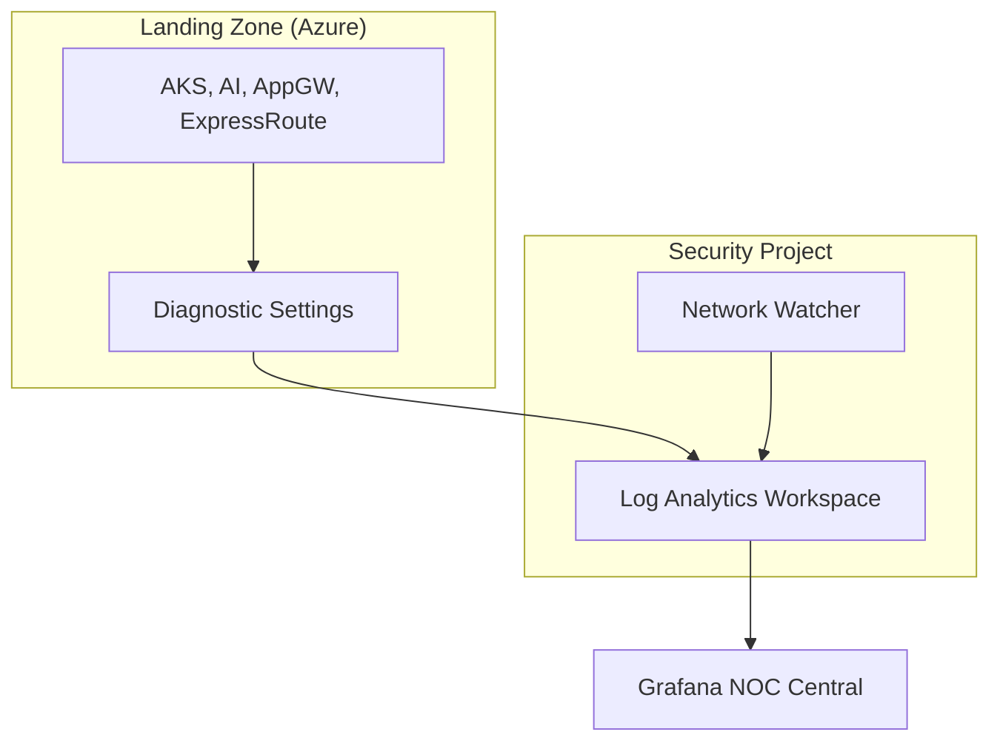

################################################################
# Titre: Observability (Azure Monitor) - README
# Description : Pourquoi instrumenter chaque brique de la Landing Zone
# Auteur: Ravindra JOB
# Source: https://github.com/ravindrajob/
# Update: 22/05/2026 [v1.2 | RJ]
################################################################

# Observability (Azure Monitor)

💡 **Rôle du composant :** 
Centraliser les journaux d'audit et les métriques de performance de l'intégralité du datacenter Azure, tout en surveillant la sécurité des flux d'IA.

## Pourquoi ce choix technique ?
L'usage de **Log Analytics** est le standard du **Microsoft CAF**. Nous déportons cette instance dans un projet de sécurité dédié pour garantir que même en cas de compromission d'un Spoke applicatif, les traces d'audit restent inviolables.

## Hardening & Gouvernance (CAF & CNCF)
- **AI Safety Audit :** Nous capturons les logs de filtrage de contenu et d'audit d'Azure OpenAI pour valider la conformité au protocole **Action-to-Action (A2A)**.
- **Traffic Analytics :** Activation des NSG Flow Logs couplés à Traffic Analytics pour visualiser les flux réseau et détecter les anomalies de micro-segmentation.
- **Circuit Monitoring :** Instrumentation spécifique d'ExpressRoute pour surveiller la latence et la perte de paquets sur la liaison hybride.

---
*Adoption industrialisée du CAF avec surcouche de sécurité et intégration des pratiques CNCF.*
