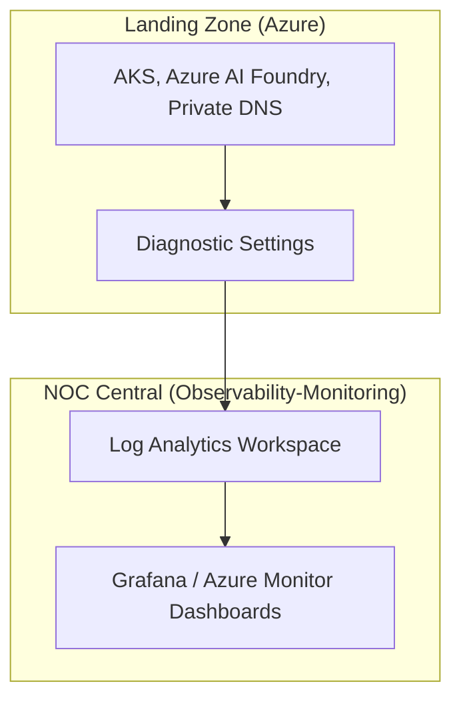

# Observability (Azure Monitor) > **Architecture :** Monitoring centralisé et gouvernance des flux | **Version :** v2.3 | **Maintainer :** [Ravindra JOB](https://github.com/ravindrajob/)

## Rôle du composant
Le déport de l'observabilité est une pratique fondamentale du **SRE (Site Reliability Engineering)** visant à garantir que les signaux critiques (Golden Signals) sont collectés et stockés en dehors du périmètre de production immédiat. Cette approche permet d'éviter les **SPOF (Single Point of Failure)** : en cas de compromission ou de défaillance majeure de la Landing Zone, les traces d'audit et les métriques de performance restent accessibles et intègres dans le socle de sécurité centralisé.

## Hardening & Gouvernance
La configuration applique des contrôles de sécurité rigoureux conformes aux standards industriels :
- **Audit DNS (Private DNS Logs) :** Surveillance de toutes les requêtes de résolution interne pour identifier les vecteurs d'exfiltration.
- **Audit IA A2A (Azure OpenAI) :** Journalisation des prompts et des réponses via Azure API Management pour assurer la conformité au protocole **Action-to-Action**.
- **NSG Flow Logs :** Audit détaillé du trafic réseau entrant et sortant pour valider les politiques de micro-segmentation.
- **Diagnostic Settings :** Instrumentation systématique de chaque ressource Azure pour l'envoi des métriques et logs vers le Log Analytics Workspace centralisé.

## Schéma Mermaid

## Conclusion
Adoption industrialisée du CAF avec surcouche de sécurité et intégration des pratiques CNCF.
