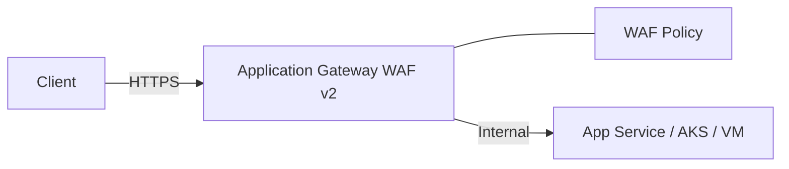

# Ravindra JOB - Cloud Architect
## Composant Landing Zone - ReverseProxy (Application Gateway WAF v2)
### Version: v1.2

## Rôle du composant
Équilibreur de charge de couche 7 (HTTP/HTTPS) offrant des capacités de routage avancé et une protection Web Application Firewall (WAF) intégrée.

## Hardening & Gouvernance
- **WAF v2 Managed Rules** : Utilisation des jeux de règles managés par Microsoft (DRS) pour une protection contre les vulnérabilités courantes.
- **End-to-End TLS** : Chiffrement systématique du trafic depuis le client jusqu'au backend applicatif.
- **Cookie-Based Affinity Sécurisée** : Configuration des cookies d'affinité avec les attributs HttpOnly et Secure.
- **Logs de Diagnostic** : Exportation des logs d'accès et des logs WAF vers Azure Log Analytics pour une surveillance en temps réel.
- **Standards** : Alignement avec les recommandations de protection applicative du CAF et les principes Ingress de la CNCF.

## Schéma Mermaid

## Conclusion
Adoption industrialisée du CAF avec surcouche de sécurité et intégration des pratiques CNCF.
