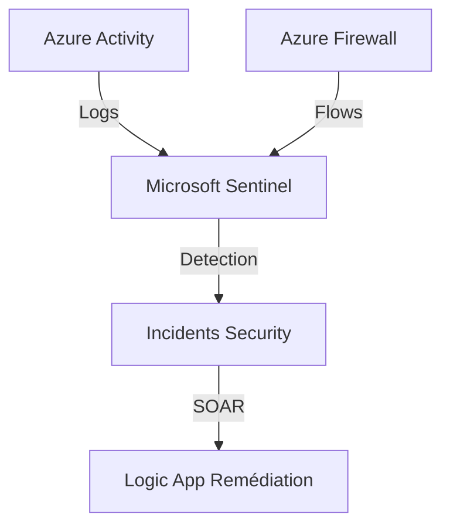

# SecOps (Microsoft Sentinel)
> **Architecture :** SIEM/SOAR moderne pour la détection et la réponse aux incidents | **Version :** v2.3 | **Maintainer :** [Ravindra JOB](https://github.com/ravindrajob/)
---

## Rôle du composant
Le centre opérationnel de sécurité (SOC) du Datacenter Azure. Il agrège les logs de toutes les ressources (Firewall, AKS, AppGW) pour détecter les menaces via l'analyse comportementale (UEBA) et l'IA.

## Hardening & Gouvernance
- **Centralized Logging (Security) :** Onboarding automatique de Microsoft Sentinel sur le Log Analytics Workspace déporté.
- **Threat Intelligence (SecOps) :** Utilisation des flux de menaces Microsoft et CNCF pour corréler les événements.
- **Automation (SOAR) :** Capacité de réponse automatisée (Playbooks) via Azure Logic Apps pour bloquer une IP suspecte.

## Schéma Mermaid

## Conclusion
Adoption industrialisée du CAF avec surcouche de sécurité et intégration des pratiques CNCF.
