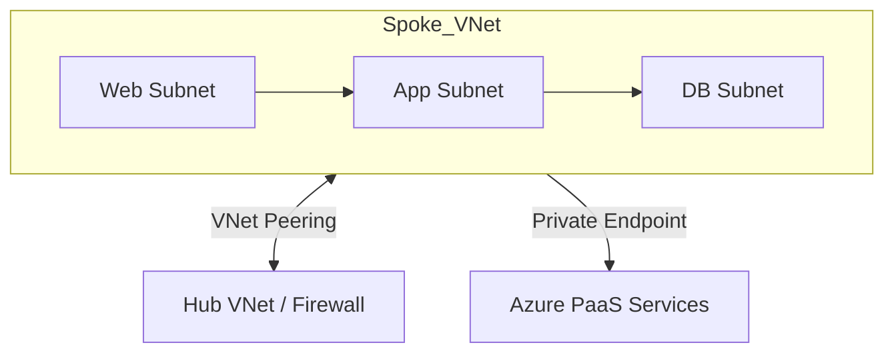

# Workloads (VNet Spokes)
> **Architecture :** Provisionnement de réseaux virtuels (VNets) isolés pour l'hébergement des workloads applicatifs, connectés au Hub via le peering VNet et respectant une topologie Hub & Spoke. | **Version :** v2.3 | **Maintainer :** [Ravindra JOB](https://github.com/ravindrajob/)
---

## Hardening & Gouvernance
- **NSG Stricts** : Application systématique de Network Security Groups (NSG) sur chaque sous-réseau avec des règles par défaut "Deny All".
- **UDR (User Defined Routes)** : Forçage de tout le trafic sortant vers l'Azure Firewall du Hub via des tables de routage personnalisées.
- **Zéro IP Publique** : Interdiction via Azure Policy du déploiement d'adresses IP publiques sur les interfaces réseau (NIC) des machines virtuelles.
- **Private Link** : Utilisation exclusive d'Azure Private Endpoints pour l'accès aux services PaaS (Storage, SQL, etc.).
- **Standards** : Alignement avec l'Azure Cloud Adoption Framework (CAF) et les principes de micro-segmentation CNCF.

## Schéma Mermaid

## Conclusion
Adoption industrialisée du CAF avec surcouche de sécurité et intégration des pratiques CNCF.
